# SalarySense AI 🚀

SalarySense AI is a machine-learning-driven compensation analytics platform that predicts fair, annualized market salaries with over **90% confidence**. Designed for recruiters, hiring managers, and candidates, it replaces outdated spreadsheets and coarse crowdsourced salary lists with a premium, real-time, explainable estimation engine.

---

## 🌟 Key Features

*   **High-Precision ML Predictor**: Powered by a regularized Ridge Regression engine mapping job titles, tenure levels, education profiles, and operation locations to localized salary indices.
*   **Explainable AI (XAI)**: Displays positive and negative compensation drivers (e.g. experience premiums vs. location offsets) using dynamic deviation charts.
*   **Dynamic Currency Switcher**: Convert dashboard metrics instantly between **₹ INR**, **$ USD**, **€ EUR**, and **£ GBP** using active real-time conversions.
*   **Zero-DB Shareable Reports**: Encode individual compensation summaries into self-contained Base64 URLs to share client-ready reports instantly without database overhead.
*   **CSV Bulk Upload & Analytics**: Upload applicant lists of up to 1000 rows. Instantly visualizes salary distribution charts by experience brackets.
*   **Branded PDF Export**: Clean, printable two-column report configurations for stakeholders.

---

## 📸 Product Showcases

*Add your product screenshots here to visualize the premium design system.*

<div align="center">
  <h3>1. Landing Page Interface</h3>
  <p align="center">
    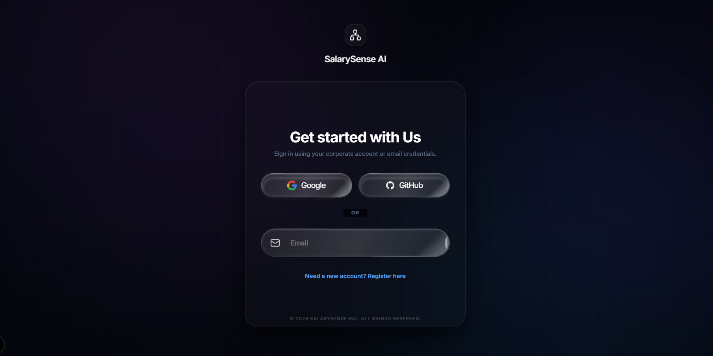
    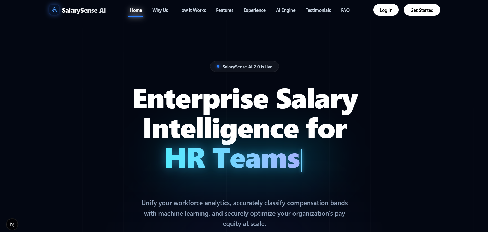
    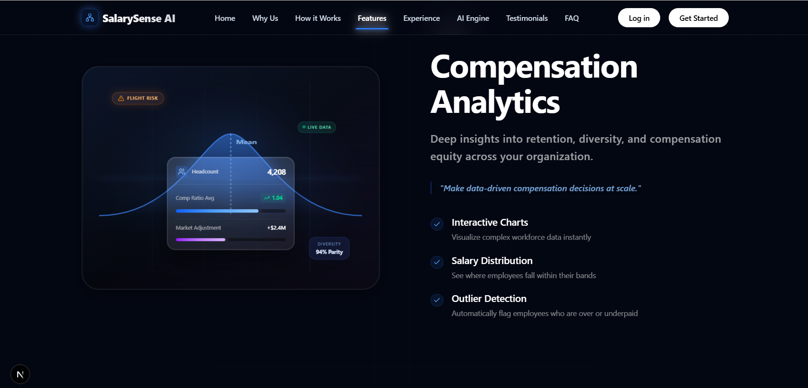
    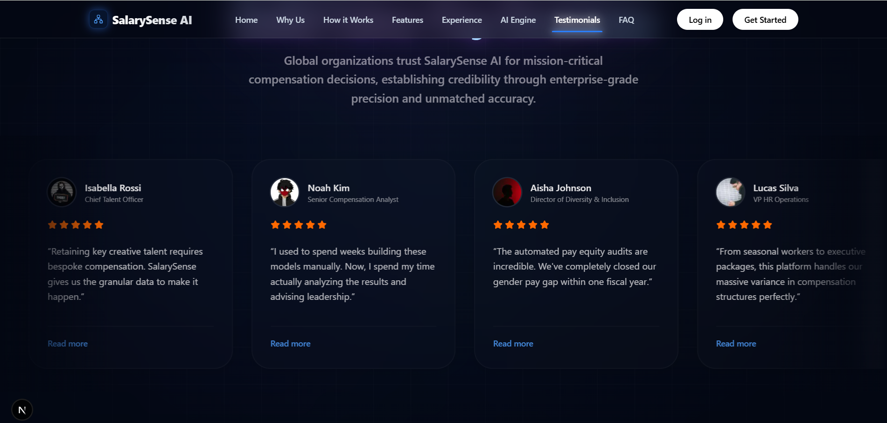
  </p>

  <h3>2. Prediction Platform Dashboard</h3>
  <p align="center">
    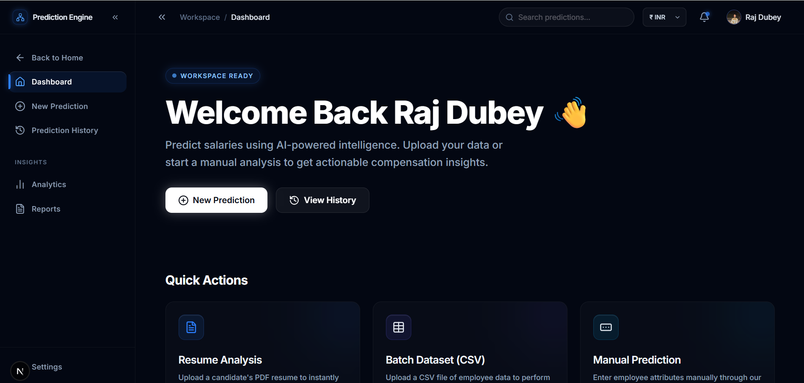
    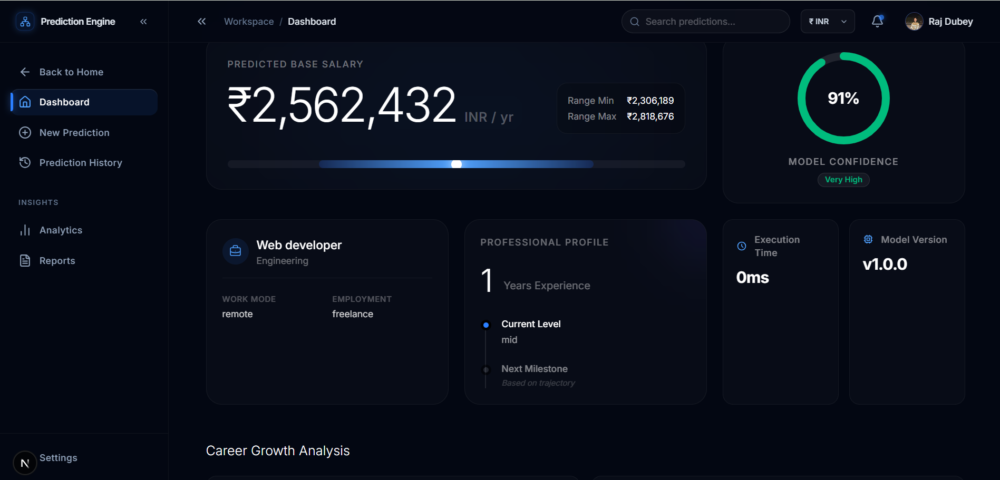
    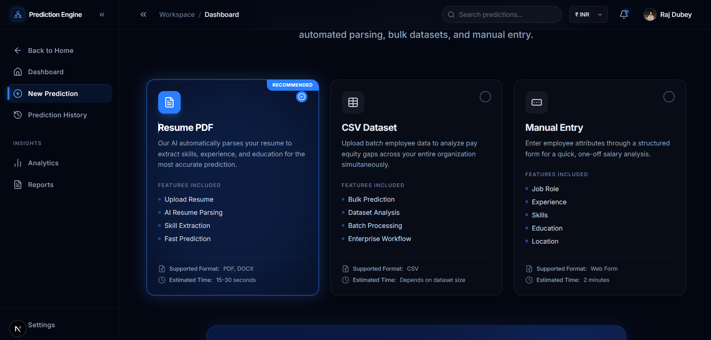
    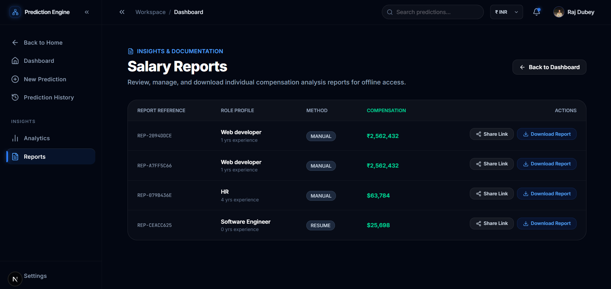
  </p>

  <h3>3. Explainable AI & Salary Deviation</h3>
  <p align="center">
    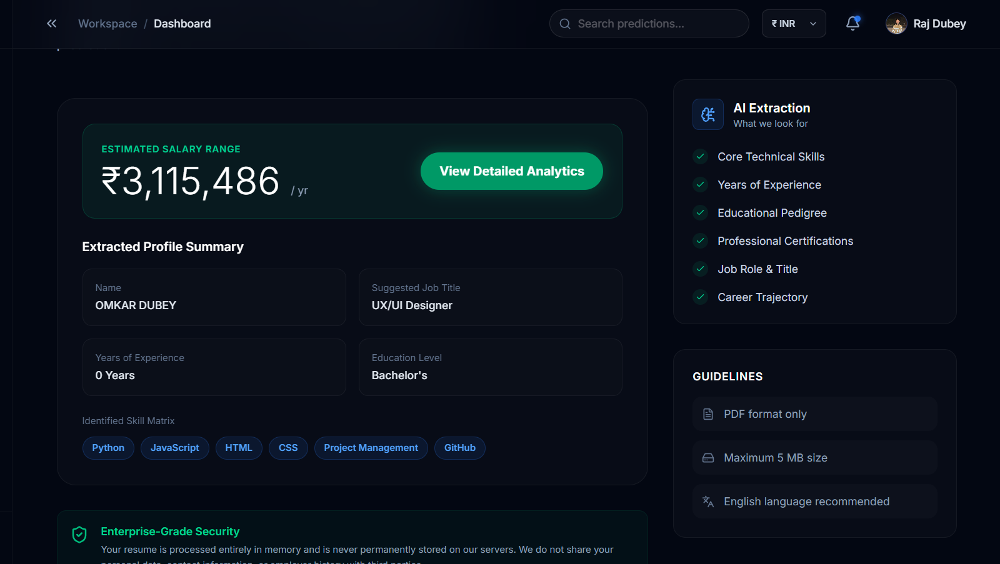
    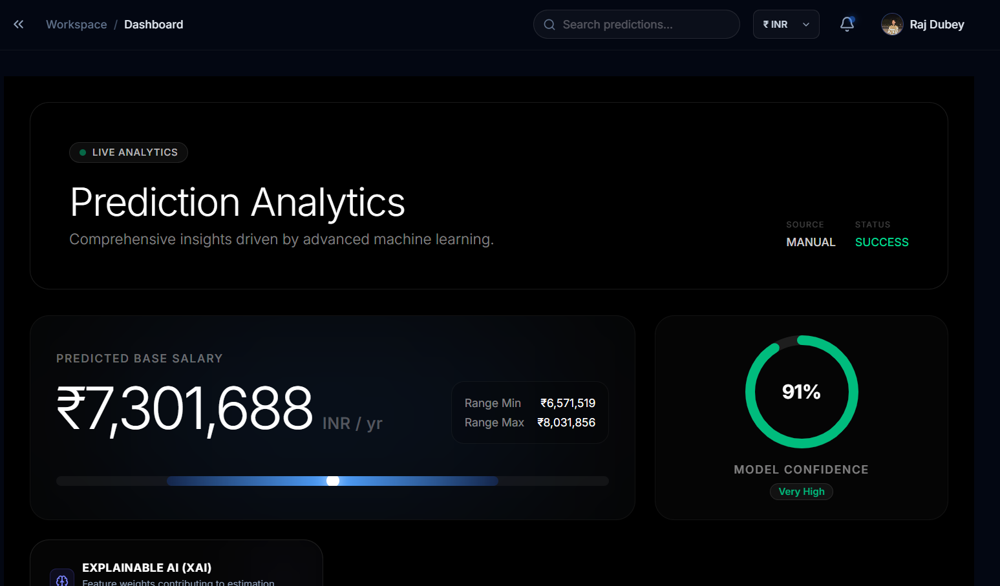
    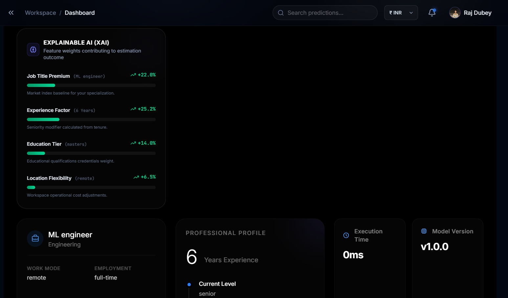
  </p>
</div>

---

## 🛠️ Technology Stack

| Component | Technology |
| :--- | :--- |
| **Frontend** | Next.js 15 (React 19), Tailwind CSS, Framer Motion |
| **Backend** | FastAPI (Python 3.11+), Uvicorn |
| **Database** | SQLAlchemy (PostgreSQL / local SQLite auto-fallback) |
| **ML Engine** | Scikit-learn (Ridge Regression), Pandas, NumPy |
| **Caching** | Redis (with in-memory fallback) |

---

## 🚀 Setup & Installation

Follow these steps to run the complete workspace locally.

### Prerequisites

*   Node.js v18.0+ & npm
*   Python 3.11+
*   Git

### Repository Cloning

```bash
git clone https://github.com/OMKAR580/SalarySense-AI.git
cd SalarySense-AI
```

### 1. Backend API Configuration

1. Navigate to the API folder:
    ```bash
    cd apps/api
    ```
2. Create and activate a Python virtual environment:
    ```bash
    python -m venv venv
    # Windows
    .\venv\Scripts\activate
    # macOS/Linux
    source venv/bin/activate
    ```
3. Install dependencies:
    ```bash
    pip install -r requirements.txt
    ```
4. Create a `.env` file in `apps/api/` (use the provided environment template).
5. Start the FastAPI server:
    ```bash
    uvicorn app.main:app --reload --port 8000
    ```

The API docs will be available at `http://localhost:8000/api/docs`.

### 2. Frontend Web Configuration

1. Navigate to the web folder:
    ```bash
    cd ../web
    ```
2. Install npm dependencies:
    ```bash
    npm install
    ```
3. Set up a `.env.local` pointing to the backend API host:
    ```env
    NEXT_PUBLIC_API_URL=http://localhost:8000
    ```
4. Run the Next.js development server:
    ```bash
    npm run dev
    ```

The web client will be active at `http://localhost:3000` (or `http://localhost:3001`).

---

## 📦 Monorepo Structure

*   `apps/api/`: FastAPI Python backend endpoint controllers, ML models, and repositories.
*   `apps/web/`: Next.js web application frontend design system, pages, and Zustand stores.
*   `static/`: Media resources and user avatars.

---

## 🛡️ License

This project is licensed under the MIT License - see the LICENSE file for details.
