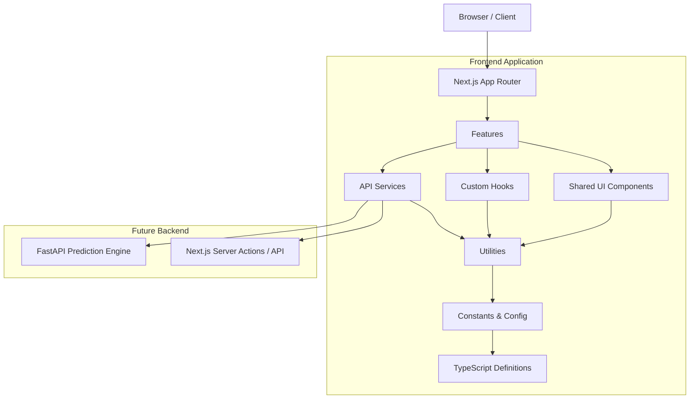

# SalarySense AI: Architecture Overview

This document outlines the high-level architecture, module boundaries, and dependency flow for the SalarySense AI application as established in Phase 0.4.

## 1. High-Level Architecture Diagram

## 2. Dependency Flow & Feature Boundaries

The architecture strictly enforces a unidirectional dependency flow to prevent circular references and tightly coupled spaghetti code.

1. **Pages (`app/`)**: Orchestrators. They fetch Server-Side data and pass it down. They import from `features/`.
2. **Features (`features/`)**: Isolated domain boundaries (e.g., `landing`, `dashboard`). Features **cannot** import from other features.
3. **Shared Modules (`components/ui`, `hooks`, `utils`)**: Domain-agnostic blocks. They **cannot** import from `features/`.
4. **Base Modules (`constants`, `types`)**: The foundation. They have zero dependencies on React or UI logic.

## 3. Folder Explanation

| Directory | Responsibility | Examples |
|-----------|----------------|----------|
| `/app` | Next.js Routing, Pages, and Layouts | `page.tsx`, `layout.tsx`, `globals.css` |
| `/features` | Feature-specific business logic and UI | `landing/components/Hero`, `landing/components/WhySalarySense` |
| `/components/ui`| Generic, reusable presentation components | `Button.tsx`, `Container.tsx` |
| `/hooks` | Shared React state and lifecycle logic | `useProgressAnimation.ts`, `useTypewriter.ts` |
| `/utils` | Pure helper functions and class mergers | `cn()` in `utils.ts` |
| `/animations` | Framer Motion variants | `variants.ts`, `floating.ts` |
| `/constants` | Hardcoded data, config, marketing copy | `landing.ts` (Phrases, Cards) |
| `/types` | Global TypeScript definitions | `landing.ts` (StoryCardData) |
| `/config` | Environment validation and setup | `env.ts` (Zod parsing) |
| `/docs` | Engineering guidelines and audit reports | `ARCHITECTURE.md`, `ENGINEERING_GUIDELINES.md` |

## 4. Client vs. Server Components (RSC)
By default, the architecture leverages **React Server Components (RSC)** for maximum performance and SEO.
- **Data Fetching**: Occurs in Server Components (`app/page.tsx`).
- **Interactivity**: Components requiring `useState`, `useEffect`, or `framer-motion` are wrapped in `"use client"` as far down the tree as possible (e.g., `HeroDashboard.tsx`).

## 5. Future Scalability Roadmap (Phase 1+)

As we scale into a full SaaS product, the architecture will expand cleanly:
1. **Authentication (`features/auth`)**: JWT-based auth via NextAuth or Clerk.
2. **Organization Management (`features/org`)**: RBAC, billing, and user management.
3. **Analytics Dashboard (`features/dashboard`)**: Moving from mock visualizations to real data fetching via Server Actions or React Query.
4. **Prediction Engine (`services/ml`)**: WebSocket connections and streaming REST endpoints to the FastAPI model servers.

The strict decoupling of `types`, `constants`, and `ui` ensures that replacing static data with dynamic API data will require zero visual or structural refactoring.
