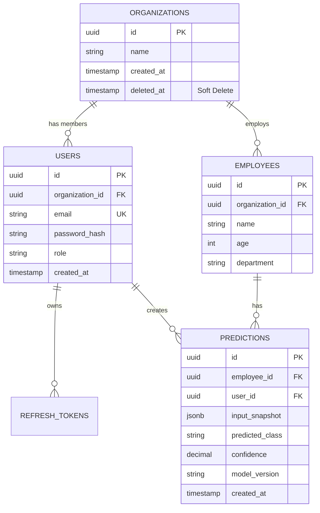
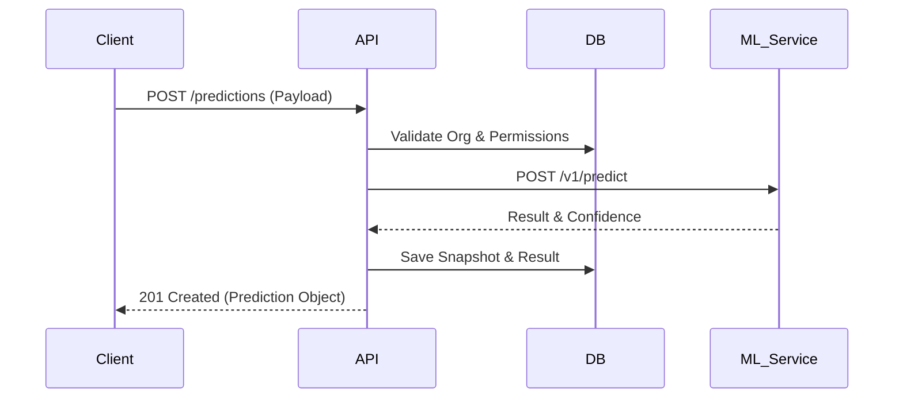
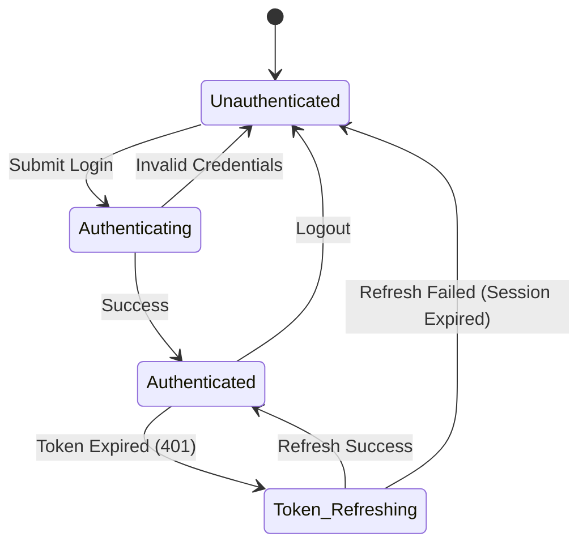

# SalarySense AI: Technical Blueprint (Phase 1.6)

## 1. Complete API Contract Documentation

### Base URL & Standards
- **Base URL:** `/api/v1`
- **Content-Type:** `application/json`
- **Pagination:** Cursor-based (`?cursor=xyz&limit=20`) or Offset-based (`?page=1&limit=20`) depending on data volume.
- **Sorting:** `?sort=-created_at,name` (prefix `-` for descending).
- **Rate Limits:** 100 req/min for authenticated users. 10 req/min for auth endpoints.
- **Authentication:** Bearer token (JWT) via `Authorization` header.

### Standard Response Envelope
```json
{
  "data": { ... },
  "meta": {
    "requestId": "req_123abc",
    "pagination": { "nextCursor": "...", "hasMore": true }
  }
}
```

### Standard Error Envelope
```json
{
  "error": {
    "code": "API_VALIDATION_ERROR",
    "message": "Invalid input provided.",
    "details": [
      { "field": "age", "issue": "Must be greater than 18" }
    ],
    "requestId": "req_123abc"
  }
}
```

### Key Endpoints
1. `POST /auth/login`: Accepts `email`, `password`. Returns JWT and Refresh Token.
2. `POST /auth/refresh`: Accepts Refresh Token. Returns new JWT.
3. `POST /predictions`: Accepts prediction payload (Idempotency-Key required). Returns Prediction object.
4. `GET /predictions`: Returns paginated history.

---

## 2. ML Integration Contract

The backend will communicate with a separate ML microservice.

- **Endpoint:** `POST {ML_SERVICE_URL}/v1/predict`
- **Timeout Strategy:** 5000ms hard timeout.
- **Retry Policy:** 3 retries, exponential backoff (initial 500ms). Only retry on 502, 503, 504.
- **Input Schema:**
  ```json
  {
    "predictionId": "uuid",
    "features": {
      "age": 28,
      "experienceYears": 5,
      "educationLevel": "BACHELORS",
      "department": "ENGINEERING"
    }
  }
  ```
- **Output Schema:**
  ```json
  {
    "predictionId": "uuid",
    "predictedClass": "HIGH",
    "confidence": 0.89,
    "modelVersion": "v1.2.0",
    "explainability": { "topFeatures": ["experienceYears"] }
  }
  ```

---

## 3. Database Finalization (ERD)


*Indexes:* `idx_users_email`, `idx_predictions_org_created`
*Multi-tenant Rule:* All queries MUST include `WHERE organization_id = ?`.

---

## 4. Backend Module Contracts

- **Core Module:** Dependency injection, Config, Security, DB Sessions.
- **Auth Module:** Login, Registration, JWT generation, Password Hashing.
- **Organization Module:** Multi-tenancy logic, Memberships, Roles.
- **Prediction Module:** ML orchestration, Fallbacks, Result persistence.
- **Worker/Queue Module:** Celery tasks for Batch CSV processing and Emails.

---

## 5. Frontend API Consumption Guide

- **Library:** Axios wrapped with React Query.
- **Loading:** Use `useQuery().isLoading` for skeleton screens. Use `useMutation().isPending` for button spinners.
- **Optimistic Updates:** Update the React Query cache immediately on mutation (e.g., updating an employee profile), rollback on error.
- **Offline Behavior:** Read-only mode via React Query cache. Mutations show an offline toast.
- **Retries:** Handled automatically by React Query for GET requests (max 3 retries).

---

## 6. Error Catalog

- `AUTH_001`: Invalid Credentials
- `AUTH_002`: Token Expired
- `API_400`: Validation Error
- `API_404`: Resource Not Found
- `API_429`: Rate Limit Exceeded
- `PRED_001`: ML Service Unavailable
- `PRED_002`: Batch Processing Failed
- `DB_001`: Unique Constraint Violation
- `FILE_001`: Invalid File Type (CSV only)
- `SYS_500`: Internal Server Error

---

## 7. Validation Specification

- **Email:** RFC 5322 regex, max 255 chars.
- **Password:** Minimum 8 chars, 1 uppercase, 1 number, 1 special character.
- **Age:** Integer between 18 and 100.
- **Experience Years:** Decimal between 0 and 60.
- **Pagination Limit:** Min 1, Max 100. Default 20.

---

## 8. Security Contract

- **JWT Flow:** Short-lived access token (15 mins) injected in memory.
- **Refresh Flow:** HttpOnly, Secure, SameSite=Strict cookie for the Refresh Token (7 days).
- **Session Flow:** Database tracks active sessions. Logging out deletes the Refresh Token cookie and invalidates the session ID in the DB.
- **Permission Flow:** PBAC (Permission-Based Access Control). Check `user.permissions.includes('prediction:create')` at the API Gateway/Middleware layer.

---

## 9. OpenAPI Blueprint

The API will be fully documented via OpenAPI 3.0.3 auto-generated by FastAPI.
- Hosted at `/api/docs` (Swagger UI) and `/api/redoc` (ReDoc).
- All endpoints must include Pydantic models for both Request and Response to ensure accurate schema generation.

---

## 10. Sequence Diagrams

### Prediction Flow


---

## 11. State Flow Diagrams

### Authentication State Flow


---

## 12. Deployment Flow

1. **Commit to Main**: Triggers GitHub Actions.
2. **CI Pipeline**: Lint -> Type Check -> Unit Tests -> E2E Tests.
3. **Build**: Docker image generated and pushed to registry. Frontend built via Vite.
4. **Staging**: Auto-deployed to Staging environment. Database migrations run via Alembic.
5. **Approval**: Manual gate for Production.
6. **Production**: Zero-downtime deployment. Webapp to Vercel, API to Render/AWS.

---

## 13. Environment Variables Documentation

- `ENV`: `development` | `staging` | `production`
- `DATABASE_URL`: PostgreSQL connection string.
- `JWT_SECRET`: High-entropy secret for signing tokens.
- `ML_SERVICE_URL`: URL of the prediction model API.
- `REDIS_URL`: For Celery/Queues and Rate Limiting.
- `CORS_ORIGINS`: Comma-separated list of allowed domains.

---

## 14. Configuration Documentation

- **Frontend Config:** Centralized in `src/config/env.ts`, strongly typed via Zod.
- **Backend Config:** Centralized in `app/core/config.py` using `pydantic-settings`. App fails to boot if required variables are missing.

---

## 15. Logging Specification

- **Format:** JSON lines in production. Human-readable in development.
- **Fields:** `timestamp`, `level`, `request_id`, `user_id`, `event`, `latency_ms`.
- **Masking:** PII (emails, passwords, tokens) MUST be masked/omitted before writing to stdout.

---

## 16. Monitoring Specification

- **APM:** Sentry configured for both React and FastAPI.
- **Metrics:** Prometheus endpoint `/metrics` exposed for Grafana scraping.
- **Alerts:** Slack alerts triggered on 5xx errors > 1% over a 5-minute window, or ML Service latency > 4000ms.

---

## 17. Folder Naming Convention

- Use `kebab-case` for all folders and files across both frontend and backend.
- Exceptions: React Components use `PascalCase.tsx`.
- Example: `feature-auth/`, `user-profile.tsx`, `database-migrations/`.

---

## 18. API Naming Convention

- Nouns for resources, strictly plural: `/users`, `/predictions`, `/organizations`.
- Nested resources for relationships: `/organizations/{id}/members`.
- Actions for non-CRUD operations: `/predictions/batch-process` or `/auth/login`.

---

## 19. Git Branching Strategy

- **Trunk-Based Development:** `main` is always deployable.
- **Branches:** `feature/ticket-number-description`, `bugfix/ticket-number`, `hotfix/critical-issue`.
- **Commits:** Conventional Commits (`feat: ...`, `fix: ...`, `chore: ...`).

---

## 20. Development Standards

- **Formatting:** Prettier (Frontend), Black (Backend).
- **Linting:** ESLint (Frontend), Ruff (Backend).
- **Typing:** Strict TypeScript (no `any`), Strict Mypy (Python).
- **PRs:** Require 1 approved review, passing CI, and 100% test coverage on new business logic.

---

### Declaration
**Phase-1.6 COMPLETE.** 
**Development Planning FINISHED.** 
**Project Ready for Phase-2 Implementation.**
